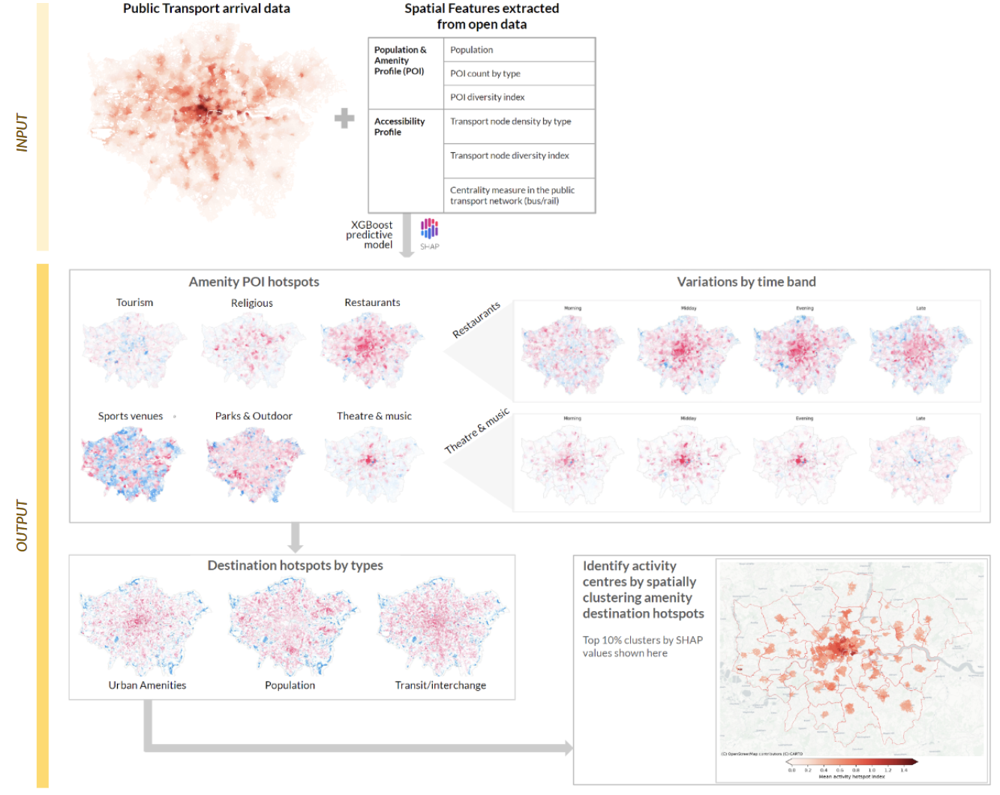
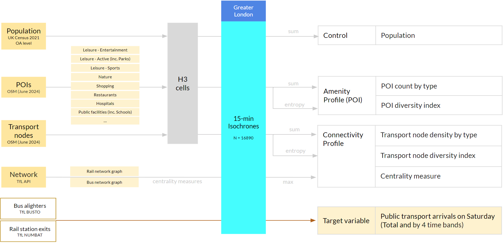
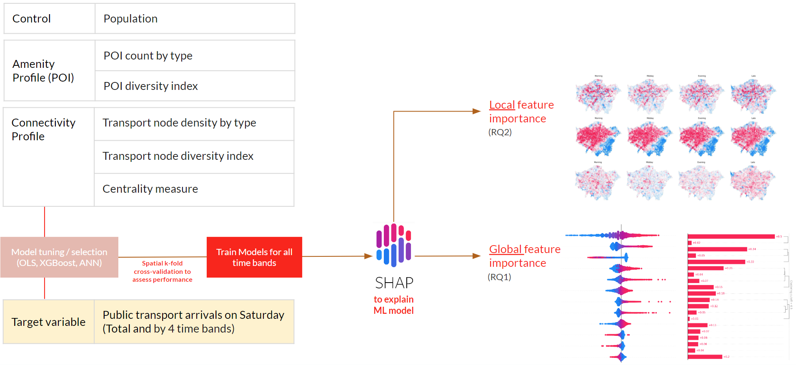

# CASA-TFL Dissertation Project repository

## Title
Londoners' Day Out: Predicting Non-commute Trip Attraction and Activity Hotspots in Greater London with Explainable Machine Learning and Open Data

## Abstract

Using explainable machine learning techniques (SHAP) on the predictions of an XGBoost model, we were able to use amenity and connectivity features extracted from open data of an area to predict with high accuracy ($R^2>80\%$) total arrivals by public transport in a given area in Greater London, representing the area's 'trip attractiveness'. The use of SHAP machine learning explanations further provides insights into the spatial heterogeneity of the feature importance, enabling the identification of destination hotspots for different purposes, such as urban activities or transit interchange. The methodology can be extended to analysing public transport mobility patterns in other localities since it relies on open data sources such as OpenStreetMap and the national censuses. Furthermore, it serves as a foundation to be developed and adapted to analyse trip destination hotspots from mode-agnostic mobility data to inform urban planning and policy-making decisions.

Supervised by Prof. Elsa Arcaute (UCL, Alan Turing Institute) with support and guidance from partner organisation Transport for London (TfL) 

## Findings

## Methodology
#### Data preprocessing and feature engineering

#### Model selection, training and explanation with SHAP 

## Repository Structure

1. **Compile:** Contains the LaTeX files and other elements needed to compile the final PDF document

1. **Code:** Contains the Jupyter notebook files for Python needed to reproduce the analysis:
    * `0_busto.ipynb`: ingests and preprocesses TfL bus demand data
    * `0_numbat.ipynb`: ingests and preprocesses TfL rail demand data
    * `1_ntwk_bus.ipynb`: builds bus network graph from raw spatial data
    * `1_ntwk_rail.ipynb`: builds rail network graph from raw spatial data
    * `1_poipop.ipynb`: ingests and preprocesses POI data from OSM data
    * `2_isochrone.ipynb`: creates 15-min-walk isochrones as spatial units of analysis using OSMNx
    * `3_feature_agg.ipynb`: aggregates all features and target variables by spatial units of analysis and creates one dataset for model training
    * `4_model_selection.ipynb`: tunes, evaluates and selects prediction model using spatial k-fold cross-validation
    * `5_model_training.ipynb`: trains chosen model on full dataset and analyses outliers
    * `6_shap.ipynb`: extracts and visualises SHAP values and explores further applications of SHAP values in identifying activity hotspots

